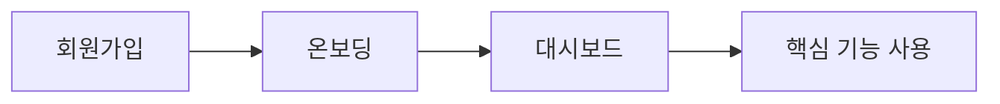
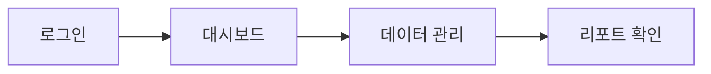

# 프로젝트 개관

## 서비스 요약

- **한 줄 요약:** <!-- 예: 학원 운영을 위한 올인원 관리 플랫폼 -->
- **타겟 사용자:** <!-- 예: 중소규모 학원 원장 및 운영 스태프 -->
- **핵심 가치:**
  1. <!-- 예: 수강생 관리 자동화 -->
  2. <!-- 예: 실시간 운영 현황 대시보드 -->
  3. <!-- 예: 간편한 결제/정산 -->

## 주요 액터

| 액터 | 역할 | 주요 행동 |
|------|------|----------|
| <!-- 원장 --> | <!-- 최고 관리자 --> | <!-- 학원 설정, 스태프 관리, 매출 확인 --> |

## 사용자 플로우

## 관리자 플로우

## 기술 스택

| 계층 | 기술 | 용도 |
|------|------|------|
| Frontend | Next.js 16 + React 19 | App Router, RSC |
| UI | TailwindCSS 4 + shadcn/ui | 디자인 시스템 |
| State | TanStack Query + Zustand | 서버/클라이언트 상태 |
| Auth/DB | Supabase Auth + Postgres + RLS | 인증, 데이터, 권한 |
| Complex Query | Drizzle ORM | 복잡 쿼리 보조 계층 |
| Validation | Zod + React Hook Form | 입력 검증 |

## 앱 URL 구조

| 경로 | 설명 | 접근 권한 |
|------|------|----------|
| `/auth/*` | 인증 화면 | 비인증 |
| `/dashboard/*` | 메인 대시보드 | 인증 + 멤버십 |
| `/api/v1/*` | API 엔드포인트 | 인증 |

## 데이터 모델 (주요 테이블)

| 테이블 | 설명 | 주요 관계 |
|--------|------|----------|
| <!-- academies --> | <!-- 학원 --> | <!-- 1:N academy_members --> |

## 핵심 기능 (Capabilities)

| # | 기능 | 설명 | MVP 포함 |
|---|------|------|---------|
| 1 | <!-- 수강 관리 --> | <!-- 수강생 등록/수정/삭제 --> | <!-- Yes --> |

## 설계 원칙

1. **Supabase RLS 우선** — 데이터 접근 권한의 최종 판단은 RLS
2. **서버 컴포넌트 기본** — 클라이언트 컴포넌트는 필요한 경우만
3. **모노레포 전환 호환** — `app → features → lib` 의존 방향 유지

## MVP 범위 외 항목

| 항목 | 사유 | 예상 시기 |
|------|------|----------|
| <!-- 예: 결제 연동 --> | <!-- 초기 검증 후 --> | <!-- Phase 2 --> |
